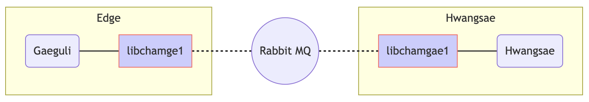

[](https://dev.azure.com/hwangsaeul/hwangsaeul/_build/latest?definitionId=5&branchName=master)

# Chamge

Chamge[tʃɑmge] is a small crab in Korean and this module aims to provide control channel
to the SRT relay server([hwangsae](https://github.com/hwangsaeul/hwangsae)) and 
Edge([gaeguli](https://github.com/hwangsaeul/gaeguli)).

This software is an [AMQP](https://www.rabbitmq.com/protocols.html#amqp-091) client
to gather information about edge and will instanciate the SRT relay on demand
according to the current load.

<!--
graph LR
subgraph Edge
  G(Gaeguli) --- CDB[libchamge1]
end
  CDB -.- R((Rabbit MQ))
  R-.-CDC[libchamgae1]

subgraph Hwangsae
  CDC---H(Hwangsae)
end
style CDC fill:#ccf,stroke:#f66
style CDB fill:#ccf,stroke:#f66
-->



## Overview

### Broker types
There are three modules for connection broker API. Theses module's states are enrolled, activated, deactivated, delisted.

#### Edge
Edge is a connection broker module for srt source devices. 

#### Arbiter
Arbiter is a connection broker module for srt management servers.

#### Hub
Hub is a connection broker module for srt relay servers.

### Agents
Role of agents are for communicating with another process. Agents include D-BUS api that is created by code generater from defined xml in the path of chamge/dbus/. Manager server's RESET Api communicate with Arbiter via D-BUS(chamge-arbiter-agent).

## D-BUS API

### Arbiter D-BUS API

**Status**
Retrieves the agent state, possible values are:
*   0x0 = NULL
*   0x1 = ENROLLED
*   0x2 = ACTIVATED

**Enroll**
Enrolls Edge device in the network

**Delist**
Delists Edge device in the network

**Activate**
Activates Edge device

**Deactivate**
Deactivates Edge device

**UserCommand**
Send user comamnd to a device

*Arguments*
*   command (s): Command to send

*Return*
*   result (i): Response status code
*   response (s): Response data

### Edge D-BUS API

**Status**
Retrieves the agent state, possible values are:
*   0x0 = NULL
*   0x1 = ENROLLED
*   0x2 = ACTIVATED

**Enroll**
Enrolls Edge device in the network

**Delist**
Delists Edge device in the network

**Activate**
Activates Edge device

**Deactivate**
Deactivates Edge device

**RequestSRTConnectionURI**
Request an SRT connection URI

*Return*
*   URI (s): URI to use to access SRT streaming.

## Build from sources
To build the from sources follow the procedure described in

[Build from sources](https://github.com/hwangsaeul/hwangsaeul.github.io/blob/master/build_from_sources.md)

## Run

### Examples
There are dummy files in examples folder. These are helper examples to implement edge/hub/arbiter.

#### Test Sequence of examples
1. Run arbiter-dummy : Arbiter's status will go to activated status automatically. It will wait for the messages from edge/hub to enroll/activate.
2. Run edge-dummy/hub-dummy : It will send enroll/activate to arbiter-dummy, and will be activated status after get response from arbiter-dummy.
3. Input user-command : arbiter-dummy will send the sample user command according to user's key input. If you want to check what kind command you can use, try "h".

## PPA nightly builds

Experimental versions of Chamge are daily generated in [launchpad](https://launchpad.net/~hwangsaeul/+archive/ubuntu/nightly).

```console
$ sudo add-apt-repository ppa:hwangsaeul/nightly
$ sudo apt-get update
$ sudo apt-get install libchamge1 libchamge-dev chamge-tools
```

